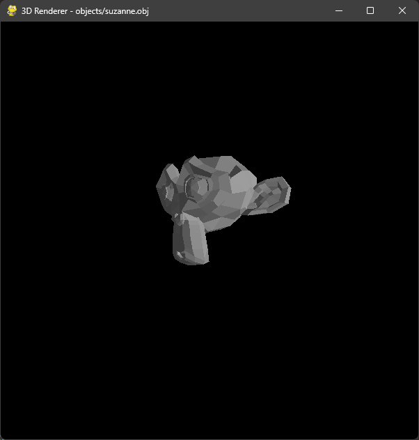
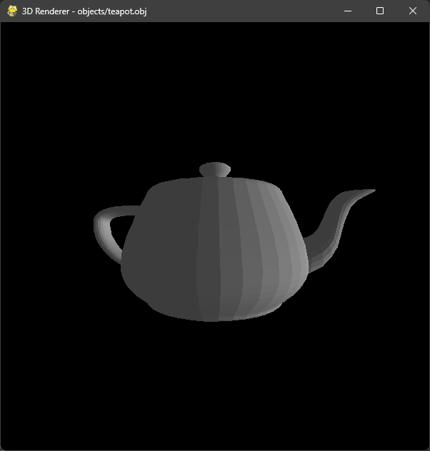

# 3D Renderer
## Overview
A basic software renderer for `.obj` files, written in Python using Pygame.

This project was built purely as a learning excercise to help me understand:
- How `.obj` files are structured
- Basic 3D transformations (rotations, camera transforms)
- Perspective projection
- Depth sorting with painter's algorithm
- Simple flat lighting
  
There was no focus on writing clean, robust, optimized, or production-quality code. This was a strictly educational project.

It is not complete and I currently have no plans to turn it into a full engine. 

*(In short: please don’t take this as representative of my coding standards — this was built to understand the math and file format, not to be production-ready.)*

## Installation
1. Clone The Repository
`git clone https://github.com/Elliptical52/3D-Renderer`
`cd 3D-Renderer`
2. Install Dependencies
Make sure you have Python 3.10+ installed.
Install pygame: `pip install pygame`
3. Run the program
`python main.py`

## Configuration
To tweak properties of the renderer, open config.py and modify the variables:
- `WIDTH`, `HEIGHT` — Initial window size

- `FPS` — Target framerate

- `camera_position` — Initial camera position (x, y, z)

- `camera_rotation` — Initial camera rotation (pitch, yaw, roll)

- `light_direction` — Direction vector for flat lighting

- `object_to_load` — Path to the .obj file loaded at startup (the `objects` directory already contains some demo files)

## Gallery

